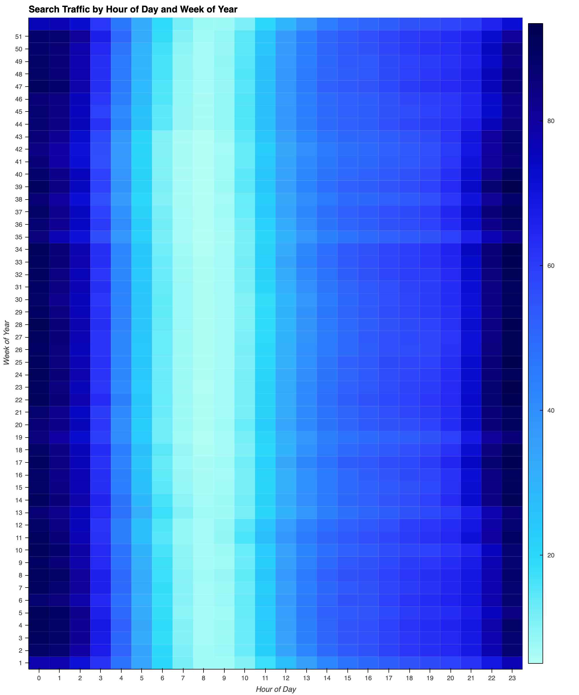
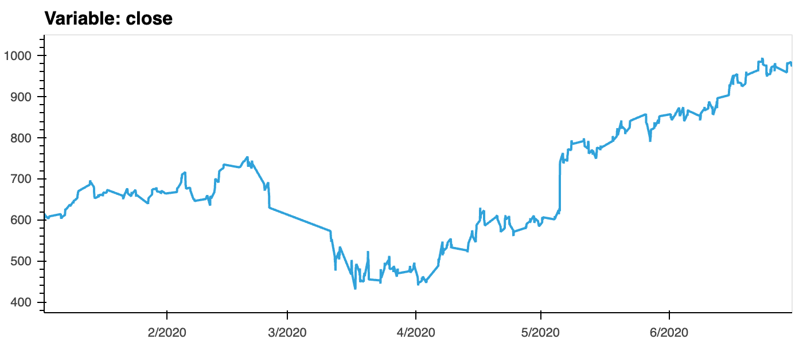
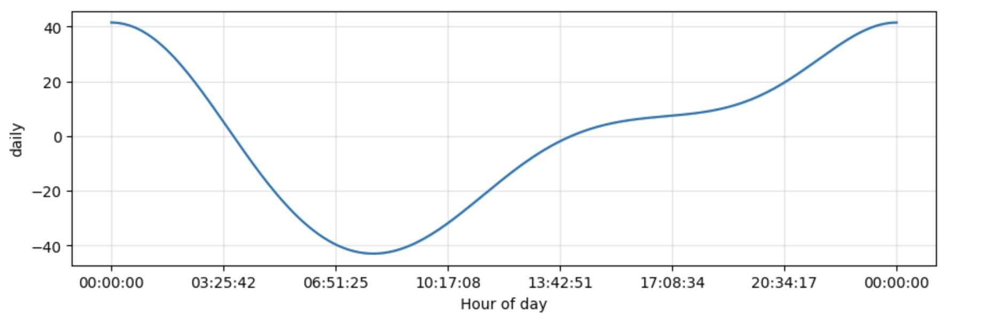

# Forecasting Net Prophet
** With over 200 million users, MercadoLibre is the most popular e-commerce site in Latin America. By analyzing the company's financial and user data, we get the following conclusions.**
--------------------------------------------------------------------------
## Find Unusual Patterns in Hourly Google Search Traffic

* The Google search traffic increased during the month when MercadoLibre released its financial results, as May 2020 had above-average search traffic. The total search traffic for May 2020 was 38,181, which is larger than the overall monthly median value of 35,172.5.*

---------------------------------------------------------------------------
## Mine the Search Traffic Data for Seasonality
* Search traffic seems to concentrate from 10 p.m. to 1 a.m. during Monday to Thursday.*

* The search traffic is not tend to increase during the winter holiday period (weeks 40 through 52).*

---------------------------------------------------------------------------
## Relate the Search Traffic to Stock Price Patterns
* Based on the two time series presented above, it can be observed that the stock price experienced a significant decline from 750 to 430 in March and April of 2020, during which the search trend also decreased. However, starting from April 2020, the stock price showed a steady increase from 450 to 982, and the search trend returned to normal levels.

* According to the correlation table, there appears to be a negative correlation between lagged search traffic and stock volatility, with a correlation coefficient of -0.1489. In contrast, there seems to be a weak and inconclusive positive correlation between lagged search traffic and hourly stock returns, as evidenced by the correlation coefficient of 0.01793, which is close to zero and suggests no clear linear relationship between these two variables.

---------------------------------------------------------------------------
## Create a Time Series Model with Prophet

* The near-term forecast for the popularity of MercadoLibre is April 2020 by using Time Series Model with Prophet.

* The greatest popularity time is around 12 p.m.

* Tuesday in week gets the most search traffic.

* October is the lowest point for search traffic in the calendar year.

---------------------------------------------------------------------------
## Forecast Revenue by Using Time Series Models

* Wednesday is the peak revenue days?.

* Expected sales for the next quarter are 969.6077, with a worst-case scenario of 887.1339 and a best-case scenario of 1052.1559.

